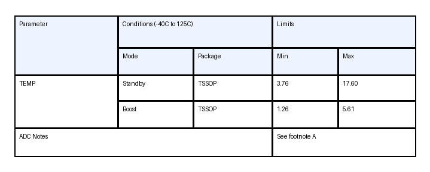
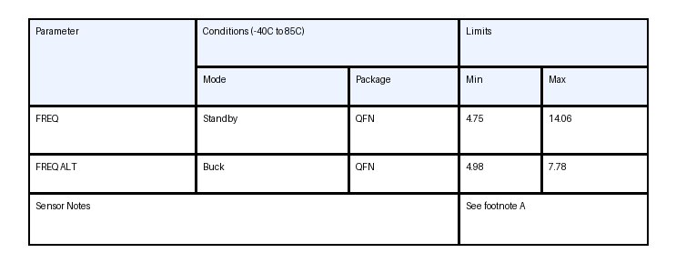
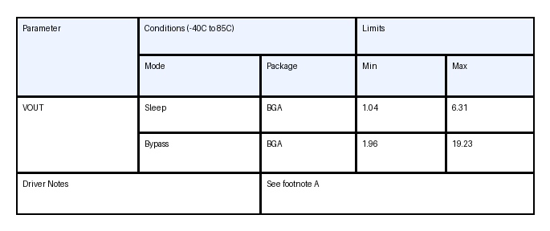
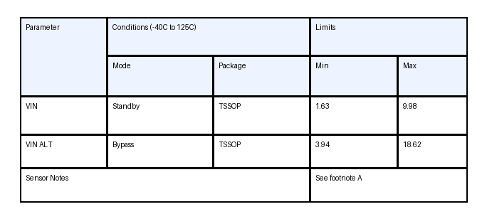
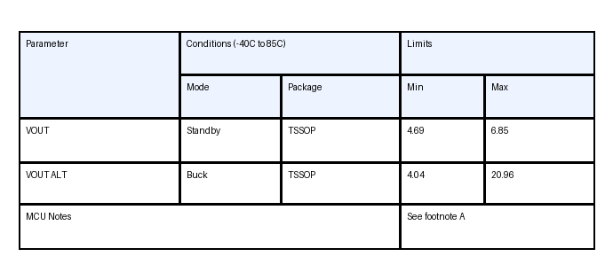
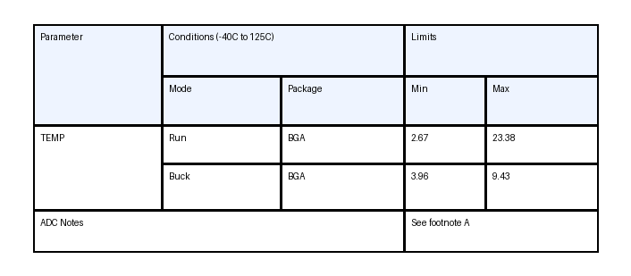
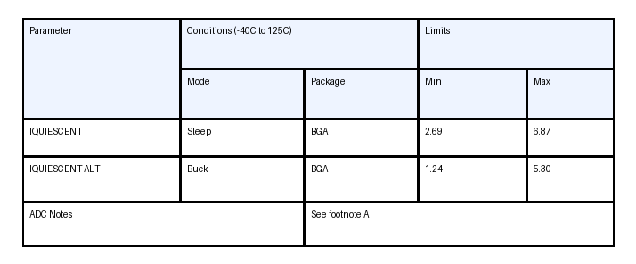
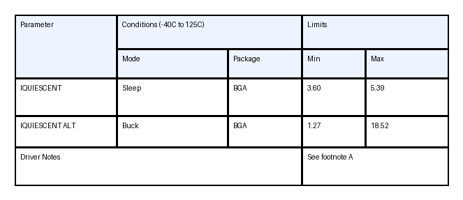

# Synthetic Preview Gallery

This folder shows a small preview of what `scripts/generate_synthetic_merged_table_data.py` produces.

What these examples include:

- merged header cells with `rowspan` and `colspan`
- merged body cells in the summary/footer row
- randomized widths, heights, packages, parameters, and values
- paired gold `HTML` labels for each rendered image

Source manifest:

- `synthetic_table_html.preview.jsonl`

## Example 1



```html
<table><thead><tr><th rowspan="2">Parameter</th><th colspan="2">Conditions (-40C to 125C)</th><th colspan="2">Limits</th></tr><tr><th>Mode</th><th>Package</th><th>Min</th><th>Max</th></tr></thead><tbody><tr><td rowspan="2">TEMP</td><td>Standby</td><td>TSSOP</td><td>3.76</td><td>17.60</td></tr><tr><td>Boost</td><td>TSSOP</td><td>1.26</td><td>5.61</td></tr><tr><td colspan="3">ADC Notes</td><td colspan="2">See footnote A</td></tr></tbody></table>
```

## Example 2



```html
<table><thead><tr><th rowspan="2">Parameter</th><th colspan="2">Conditions (-40C to 85C)</th><th colspan="2">Limits</th></tr><tr><th>Mode</th><th>Package</th><th>Min</th><th>Max</th></tr></thead><tbody><tr><td>FREQ</td><td>Standby</td><td>QFN</td><td>4.75</td><td>14.06</td></tr><tr><td>FREQ ALT</td><td>Buck</td><td>QFN</td><td>4.98</td><td>7.78</td></tr><tr><td colspan="3">Sensor Notes</td><td colspan="2">See footnote A</td></tr></tbody></table>
```

## Example 3



```html
<table><thead><tr><th rowspan="2">Parameter</th><th colspan="2">Conditions (-40C to 85C)</th><th colspan="2">Limits</th></tr><tr><th>Mode</th><th>Package</th><th>Min</th><th>Max</th></tr></thead><tbody><tr><td rowspan="2">VOUT</td><td>Sleep</td><td>BGA</td><td>1.04</td><td>6.31</td></tr><tr><td>Bypass</td><td>BGA</td><td>1.96</td><td>19.23</td></tr><tr><td colspan="2">Driver Notes</td><td colspan="3">See footnote A</td></tr></tbody></table>
```

## Example 4



```html
<table><thead><tr><th rowspan="2">Parameter</th><th colspan="2">Conditions (-40C to 125C)</th><th colspan="2">Limits</th></tr><tr><th>Mode</th><th>Package</th><th>Min</th><th>Max</th></tr></thead><tbody><tr><td>VIN</td><td>Standby</td><td>TSSOP</td><td>1.63</td><td>9.98</td></tr><tr><td>VIN ALT</td><td>Bypass</td><td>TSSOP</td><td>3.94</td><td>18.62</td></tr><tr><td colspan="3">Sensor Notes</td><td colspan="2">See footnote A</td></tr></tbody></table>
```

## Example 5



```html
<table><thead><tr><th rowspan="2">Parameter</th><th colspan="2">Conditions (-40C to 85C)</th><th colspan="2">Limits</th></tr><tr><th>Mode</th><th>Package</th><th>Min</th><th>Max</th></tr></thead><tbody><tr><td>VOUT</td><td>Standby</td><td>TSSOP</td><td>4.69</td><td>6.85</td></tr><tr><td>VOUT ALT</td><td>Buck</td><td>TSSOP</td><td>4.04</td><td>20.96</td></tr><tr><td colspan="3">MCU Notes</td><td colspan="2">See footnote A</td></tr></tbody></table>
```

## Example 6



```html
<table><thead><tr><th rowspan="2">Parameter</th><th colspan="2">Conditions (-40C to 125C)</th><th colspan="2">Limits</th></tr><tr><th>Mode</th><th>Package</th><th>Min</th><th>Max</th></tr></thead><tbody><tr><td rowspan="2">TEMP</td><td>Run</td><td>BGA</td><td>2.67</td><td>23.38</td></tr><tr><td>Buck</td><td>BGA</td><td>3.96</td><td>9.43</td></tr><tr><td colspan="3">ADC Notes</td><td colspan="2">See footnote A</td></tr></tbody></table>
```

## Example 7



```html
<table><thead><tr><th rowspan="2">Parameter</th><th colspan="2">Conditions (-40C to 125C)</th><th colspan="2">Limits</th></tr><tr><th>Mode</th><th>Package</th><th>Min</th><th>Max</th></tr></thead><tbody><tr><td>IQUIESCENT</td><td>Sleep</td><td>BGA</td><td>2.69</td><td>6.87</td></tr><tr><td>IQUIESCENT ALT</td><td>Buck</td><td>BGA</td><td>1.24</td><td>5.30</td></tr><tr><td colspan="2">ADC Notes</td><td colspan="3">See footnote A</td></tr></tbody></table>
```

## Example 8



```html
<table><thead><tr><th rowspan="2">Parameter</th><th colspan="2">Conditions (-40C to 125C)</th><th colspan="2">Limits</th></tr><tr><th>Mode</th><th>Package</th><th>Min</th><th>Max</th></tr></thead><tbody><tr><td>IQUIESCENT</td><td>Sleep</td><td>BGA</td><td>3.60</td><td>5.39</td></tr><tr><td>IQUIESCENT ALT</td><td>Buck</td><td>BGA</td><td>1.27</td><td>18.52</td></tr><tr><td colspan="3">Driver Notes</td><td colspan="2">See footnote A</td></tr></tbody></table>
```
